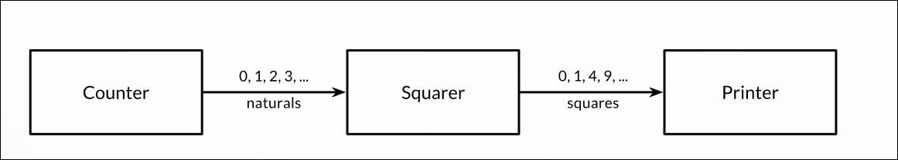

# Pipeline
    Channels can be used to connect goroutines together so that the output of one is the input to
    another. This is called a pipeline

    After a channel has been closed, any further send operations on it will panic. After the closed
    channel has been drained,

# Bidirectional Channel 

# Defination and purpose 
    Unidirectional channels in Go are channel types that restrict communication to one direction. Unlike a normal bidirectional chan T, which allows both sending and receiving, a chan<- T is a send-only channel and a <-chan T is a receive-only channel. They are particularly useful when passing channels to functions because they allow us to clearly specify whether a function is responsible for sending or receiving. This improves code readability and type safety because incorrect channel operations are detected by the compiler at compile time. For example, a producer can accept chan<- int, while a consumer can accept <-chan int. A bidirectional channel can be implicitly converted to either direction when passed to a function, but a unidirectional channel cannot be converted back to a bidirectional channel from that restricted value."

A bidirectional channel is a channel through which a goroutine is allowed to both send and receive values.

    A unidirectional channel is a channel whose use is restricted to one direction of communication.

In Go, unidirectional channels are used when a function should have access to only one channel operation:

    sending, or
    receiving.

Go provides two unidirectional channel types:

    chan <- T
    <-chan T 
1. Send-Only Channel
Definition

    A send-only channel is a channel through which a goroutine or function can only send values and cannot receive values.

Its type is:

    chan<- T

2. Receive-Only Channel
Definition

    A receive-only channel is a channel through which a goroutine or function can only receive values and cannot send values.

Its type is:

    <-chan T

Example:

    func consumer(ch <-chan int) {
        x := <-ch
        fmt.Println(x)
    }

# Channel Direction Syntax 

Bidirectional 

    chan int 

    send and recieve only 

Unidirectional 

    send  only 
    chan<- int 

    Recieve only 

    <-chan  int 

| Type         | Meaning       | Send | Receive |
| ------------ | ------------- | ---: | ------: |
| `chan int`   | Bidirectional |  Yes |     Yes |
| `chan<- int` | Send-only     |  Yes |      No |
| `<-chan int` | Receive-only  |   No |     Yes |

# Important definations 

Bidirectional Channel

    A bidirectional channel is a channel that allows both sending and receiving of values and is represented by chan T.

Unidirectional Channel

    A unidirectional channel is a channel restricted to one communication direction: either sending or receiving.

Send-only Channel

    A send-only channel is represented by chan<- T and allows values to be sent but not received.

Receive-only Channel

    A receive-only channel is represented by <-chan T and allows values to be received but not sent.

Purpose

    Unidirectional channels are used to express communication direction, improve API clarity, and prevent incorrect channel operations at compile time.

Conversion

    A bidirectional chan T can be converted to chan<- T or <-chan T, but a unidirectional channel value cannot be converted back to a bidirectional channel value referring to the same channel.